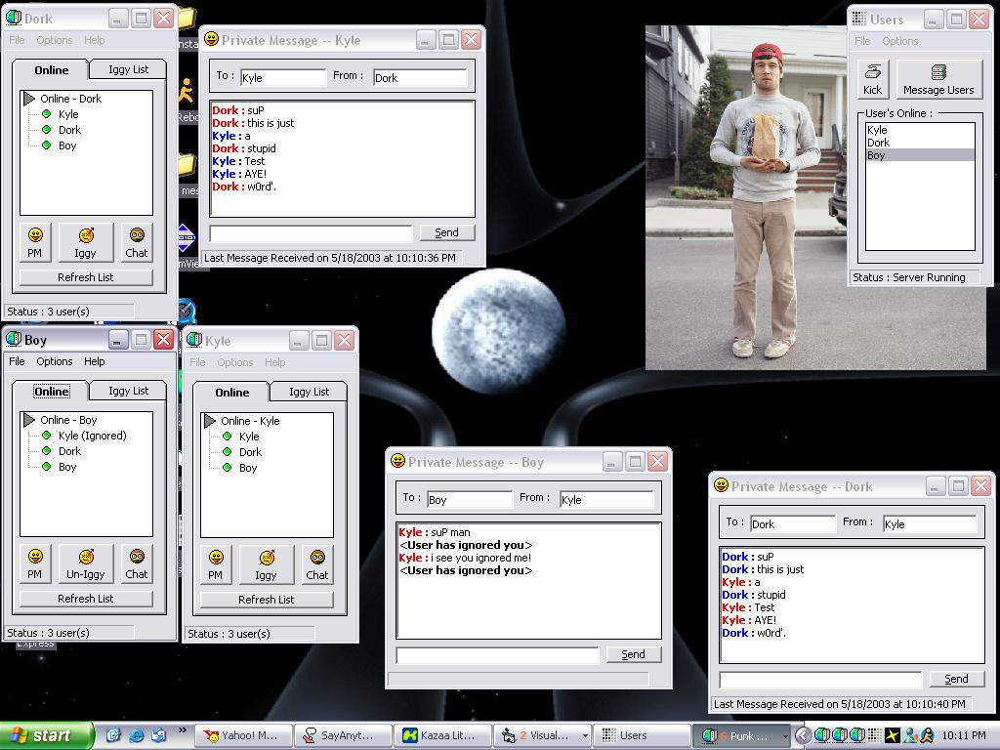



## Instant Messenger \(Client and Server\)

### Description

A basic instant messenger, used for private messaging. It can up to 30 user's, or more. Of course would have to edit coding, the coding is about as easy as your grandma on a tuesday :).Good for beginner's to learn, multiple winsock connections. Host runs the server, and walla walla bing bang!. Check out the screen shot, and check it out. I think it's the best by far on pscode. The Richtextbox color's, splitting data, ignore function, chat, private messaging, the works. Vote for me.
 
### More Info
 

             |
---                |---
**Submitted On**   |2003-05-18 22:08:10
**By**             |[Kyle](https://github.com/Planet-Source-Code/PSCIndex/blob/master/ByAuthor/kyle.md)
**Level**          |Advanced
**User Rating**    |4.5 (54 globes from 12 users)
**Compatibility**  |VB 6\.0
**Category**       |[Internet/ HTML](https://github.com/Planet-Source-Code/PSCIndex/blob/master/ByCategory/internet-html__1-34.md)
**World**          |[Visual Basic](https://github.com/Planet-Source-Code/PSCIndex/blob/master/ByWorld/visual-basic.md)
**Archive File**   |[Instant\_Me1589585192003\.zip](https://github.com/Planet-Source-Code/kyle-instant-messenger-client-and-server__1-45578/archive/master.zip)

